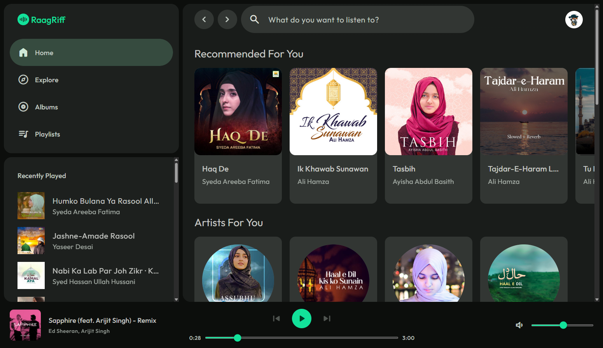

# 🎵 RaagRiff — where every RIFF meets its RAAG

A modern, feature-rich Spotify web player for discovering music, exploring albums, artists, and playlists. Browse new releases, search tracks, and stream seamlessly with Spotify Premium. Built with the Spotify Web API and Web Playback SDK.



## 🌐 Live Demo

**[Launch RaagRiff](https://raag-riff.onrender.com)** · _Hosted on [Render](https://render.com/)_

> **Note:** You need a Spotify Premium account to use the playback features.

---

## ✨ Features

### 🎧 Music Streaming & Playback

- **Real-time playback** using Spotify Web Playback SDK
- Dual player interface: compact (mobile) and expanded (desktop)
- Playback controls: play, pause, skip, seek, volume control
- Live progress tracking with interactive seek bar
- Queue management and recently played tracks sidebar

### 🔍 Music Discovery

- **Personalized recommendations** based on listening history
- Custom algorithm for featured playlists using recently played tracks
- Smart album recommendations derived from listening patterns
- Browse new releases and trending music
- Category-based playlist discovery

### 📱 User Experience

- **Material Design 3** inspired interface
- Fully responsive across 4 breakpoints (768px, 992px, 1200px, 1400px)
- Dark theme optimized for music consumption
- Smooth animations and transitions
- Accessible design with proper ARIA labels
- Progressive Web App ready

### 🎼 Content Pages

- **Home**: Personalized feed with recommendations, new releases, and playlists
- **Explore**: Browse music by categories
- **Albums**: View new releases and artist discographies
- **Playlists**: Discover featured and category playlists
- **Artists**: Detailed artist pages with top tracks and related artists
- **Tracks**: Individual track pages with lyrics (powered by Genius API)
- **Profile**: View your top artists, tracks, and followed artists
- **Search**: Multi-type search (tracks, albums, artists, playlists)

### 🎯 Advanced Features

- **Custom recommendation engine** for albums and playlists (replaces deprecated Spotify endpoints)
- **Fisher-Yates shuffle algorithm** for randomized content
- **Lyrics integration** via Genius API with intelligent cleaning and formatting
- **Smart artist discovery** using genre-based matching and collaborations
- **Pagination** for large datasets
- **Session management** with automatic token refresh
- **Error handling** with graceful fallbacks

---

## 🛠️ Tech Stack

### Backend

- **Node.js** (v20.6+) - Runtime environment
- **Express.js** (v5.1.0) - Web framework
- **EJS** (v3.1.10) - Server-side templating
- **Axios** (v1.12.2) - HTTP client for API requests
- **cookie-parser** - Cookie handling for authentication

### Frontend

- **Vanilla JavaScript** - Client-side interactivity
- **CSS3** - Styling with CSS custom properties (variables)
- **Material Symbols** - Icon font
- **Spotify Web Playback SDK** - Audio streaming

### APIs & Services

- **Spotify Web API** - Music data and user authentication
- **Spotify Web Playback SDK** - Browser-based audio playback
- **Genius API** (genius-lyrics v4.4.7) - Track lyrics fetching

### Development Tools

- **pnpm** (v10.17.0) - Package manager
- **Node.js --watch** - Development hot reload

---

## 🚀 Getting Started

### Prerequisites

- Node.js v20.6 or higher
- pnpm package manager
- Spotify Premium account
- Spotify Developer account for API credentials

### Installation

1. **Clone the repository**

   ```bash
   git clone https://github.com/KeepSerene/raag-riff-spotify-clone.git
   cd raag-riff-spotify-clone
   ```

2. **Install dependencies**

   ```bash
   pnpm install
   ```

3. **Set up environment variables**

   Create a `.env` file in the root directory:

   ```env
   PORT="5000"
   SPOTIFY_DEV_CLIENT_ID="your_spotify_client_id"
   SPOTIFY_DEV_CLIENT_SECRET="your_spotify_client_secret"
   SPOTIFY_DEV_REDIRECT_URI="http://127.0.0.1:5000/auth/callback"
   SPOTIFY_DEV_SCOPES="user-read-playback-state user-modify-playback-state user-read-currently-playing streaming user-follow-read user-top-read user-read-recently-played user-read-email user-read-private"
   GENIUS_CLIENT_ACCESS_TOKEN="your_genius_client_access_token"
   ```

4. **Configure Spotify App**

   - Go to [Spotify Developer Dashboard](https://developer.spotify.com/dashboard)
   - Create a new app
   - Add `http://127.0.0.1:5000/auth/callback` to Redirect URIs
   - Copy Client ID and Client Secret to `.env`

5. **Get Genius API Token**
   - Visit [Genius API Clients](https://genius.com/api-clients)
   - Create a new API client
   - Generate a client access token
   - Add to `.env` file

### Running the Application

**Development mode** (with hot reload):

```bash
pnpm run dev
```

**Production mode**:

```bash
pnpm start
```

The application will be available at `http://127.0.0.1:5000`

---

## 📂 Project Structure (Tentative!)

```
raag-riff/
├── public/                # Static assets
│   ├── css/               # Stylesheets
│   ├── js/                # Client-side JavaScript
│   └── images/            # Images and icons
├── src/
│   ├── api/               # API service modules
│   │   ├── albums.api.js
│   │   ├── artists.api.js
│   │   ├── playlists.api.js
│   │   ├── search.api.js
│   │   ├── tracks.api.js
│   │   └── user.api.js
│   ├── configs/           # Configuration files
│   │   ├── api.config.js
│   │   └── axios.config.js
│   ├── controllers/       # Route controllers
│   │   ├── albums.controller.js
│   │   ├── artists.controller.js
│   │   ├── explore.controller.js
│   │   ├── home.controller.js
│   │   ├── playlists.controller.js
│   │   ├── profile.controller.js
│   │   ├── search.controller.js
│   │   └── tracks.controller.js
│   ├── middlewares/       # Express middlewares
│   ├── routes/            # Route definitions
│   ├── utils/             # Utility functions
│   └── views/             # EJS templates
│       ├── layouts/       # Layout components
│       ├── partials/      # Reusable components
│       └── pages/         # Page templates
├── app.js                 # Express app setup
└── package.json
```

---

## 🎨 Design System

### Color Palette

The application uses a dark theme based on Material Design 3 principles:

- **Primary**: `#12E29A` (Mint green)
- **Background**: `#191C1A` (Dark green-grey)
- **Surface**: `#0C0E0C` (Almost black)
- **On-Surface**: `#C5C7C3` (Light grey)

### Typography

- **Font Family**: Outfit (Google Fonts)
- **Type Scale**: Material Design 3 type scale (Display, Headline, Title, Body, Label)

### Spacing System

Based on 4px grid system with CSS custom properties:

```css
--space-1: 4px
--space-2: 8px
--space-3: 12px
--space-4: 16px
/* ... up to --space-20 */
```

### Responsive Breakpoints

- **Mobile**: < 768px
- **Tablet**: ≥ 768px
- **Desktop**: ≥ 992px
- **Large Desktop**: ≥ 1200px
- **Extra Large**: ≥ 1400px

---

## 🔑 Key Routes

### Public Routes

- `GET /login` - Login page
- `GET /auth` - Spotify authorization
- `GET /auth/callback` - OAuth callback

### Protected Routes

- `GET /` - Home page with personalized content
- `GET /explore` - Browse categories
- `GET /explore/:categoryId` - Category playlists
- `GET /albums` - New releases
- `GET /albums/:albumId` - Album details
- `GET /playlists` - Featured playlists
- `GET /playlists/:playlistId` - Playlist details
- `GET /artists/:artistId` - Artist details
- `GET /artists/:artistId/albums` - Artist's albums
- `GET /tracks/:trackId` - Track details with lyrics
- `GET /me` - User profile
- `GET /me/top/artists` - User's top artists
- `GET /me/top/tracks` - User's top tracks
- `POST /search` - Search request handler
- `GET /search/:type/:query` - Search results
- `GET /api/token` - Access token endpoint (client-side)
- `GET /logout` - Logout and clear session

---

## 🎯 Custom Implementations

### 1. **Recommendation Algorithm**

Since Spotify deprecated several recommendation endpoints, custom algorithms were implemented:

**Album Recommendations**:

- Analyzes recently played tracks
- Extracts unique artists from listening history
- Searches for albums by top artists
- Sorts by release date and applies Fisher-Yates shuffle
- Returns personalized album feed

**Featured Playlists**:

- Uses recently played artists as search seeds
- Combines with mood and genre keywords
- Aggregates results from multiple search queries
- Sorts by popularity (track count)
- Applies randomization for variety

**Category Playlists**:

- Maps category IDs to search terms
- Fetches playlists via Spotify Search API
- Filters and sorts by relevance and popularity

### 2. **Related Artists Discovery**

Multi-strategy approach for finding related artists:

- Genre-based matching with score calculation
- Collaboration detection from top tracks
- Combined genre searches for specificity
- Popularity-based ranking
- Capped at 20 results for performance

### 3. **Lyrics Fetching & Cleaning**

Genius API integration with intelligent processing:

- Track name normalization (removes remasters, features)
- HTML tag removal
- Metadata stripping (contributors, translations)
- Section marker removal ([Verse], [Chorus])
- Partial lyrics display (50% or 16 lines max)
- Full lyrics available on Genius with attribution

### 4. **Performance Optimization**

- **Parallel API calls** using `Promise.all()` in controllers
- Reduced sequential dependencies
- Batched requests where possible
- Smart caching of frequently accessed data

---

## 🔐 Authentication Flow

1. User clicks "Continue with Spotify"
2. Redirected to Spotify authorization page
3. User grants permissions
4. Spotify redirects to callback with authorization code
5. Server exchanges code for access & refresh tokens
6. Tokens stored in HTTP-only cookies
7. Middleware validates tokens on protected routes
8. Automatic token refresh when expired

---

## 🎛️ Configuration

### API Configuration (`src/configs/api.config.js`)

- Spotify API base URLs
- Client credentials
- Default limits and market settings
- Genius API client setup

### Axios Configuration (`src/configs/axios.config.js`)

- Pre-configured Axios instances
- Authentication header injection
- Error handling utilities

---

## 🐛 Known Issues & Limitations

### Performance

- **Navigation Speed**: The application may feel slow during navigation as it performs server-side rendering with multiple API calls. This is expected behavior for the current architecture.
- **Home Page Loading**: The home page performs the most API calls and may take longer to load than other pages.

### Browser Compatibility

- **Firefox Issues**: Users on Firefox may experience playback interruptions:
  - Tracks may stop playing unexpectedly
  - Audio may cut out after approximately 30 seconds
  - These issues are related to the Spotify Web Playback SDK and browser compatibility
  - **Workaround**: Use Chrome, Edge, or other Chromium-based browsers for the best experience

### Future Improvements

- Client-side navigation for faster page transitions
- Service Worker implementation for offline support
- Enhanced caching strategies
- Firefox playback stability improvements

---

## 📜 License

This project is licensed under the **Apache License 2.0**.

```
Copyright 2025 Dhrubajyoti Bhattacharjee

Licensed under the Apache License, Version 2.0 (the "License");
you may not use this file except in compliance with the License.
You may obtain a copy of the License at

    http://www.apache.org/licenses/LICENSE-2.0

Unless required by applicable law or agreed to in writing, software
distributed under the License is distributed on an "AS IS" BASIS,
WITHOUT WARRANTIES OR CONDITIONS OF ANY KIND, either express or implied.
See the License for the specific language governing permissions and
limitations under the License.
```

---

## 👨‍💻 Author

**Dhrubajyoti Bhattacharjee**

- Portfolio: [math-to-dev](https://math-to-dev.vercel.app)
- Twitter: [@UsualLearner](https://twitter.com/UsualLearner)
- GitHub: [KeepSerene](https://github.com/KeepSeren)

---

## 🙏 Acknowledgments

- [Spotify Web API](https://developer.spotify.com/documentation/web-api) for music data
- [Spotify Web Playback SDK](https://developer.spotify.com/documentation/web-playback-sdk) for audio streaming
- [Genius](https://genius.com) for lyrics data
- [Material Design 3](https://m3.material.io) for design inspiration
- [Google Fonts](https://fonts.google.com) for the Outfit typeface

---

## 📧 Support

For issues, questions, or suggestions, please [open an issue](https://github.com/KeepSerene/raag-riff-spotify-clone/issues) on GitHub.

---

<div align="center">
  <p>Made with ❤️ and 🫗</p>
  <p>⭐ Star this repo if you like it!</p>
</div>
